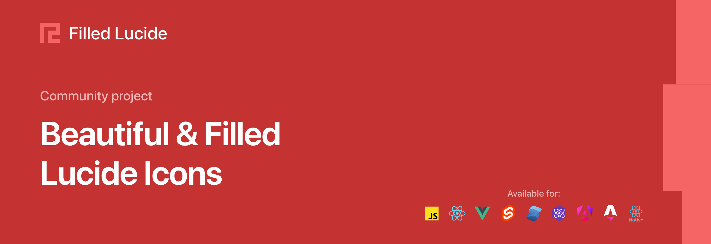
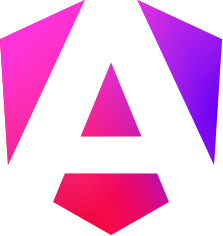

<p align="center">
  <a href="https://filledlucide.dev">
    
  </a>
</p>

<p align="center">
  <a href="https://www.npmjs.com/package/@filled-lucide/react"></a>
  <a href="https://github.com/linus-sch/filled-lucide/actions/workflows/ci.yml"></a>
  <a href="LICENSE"></a>
</p>

<p align="center">
  <a href="https://filledlucide.dev">Icons</a>
  ·
  <a href="https://filledlucide.dev/packages/">Packages</a>
  ·
  <a href="#usage">Guide</a>
  ·
  <a href="LICENSE">License</a>
  ·
  <a href="https://lucide.dev">Lucide</a>
</p>

# Filled Lucide

A solid variant of the [Lucide](https://lucide.dev) icon set: all **1,776 icons**
(plus **355 lab icons**) redrawn as filled silhouettes, with the same names, the
same 24×24 grid and the same package API as upstream Lucide.

## Packages

| Logo                                                                                                                                                                                                                | Package                           | Replaces              | Version                                                                                                                       | Downloads                                                                                                                            | Links                                                                                |
| ------------------------------------------------------------------------------------------------------------------------------------------------------------------------------------------------------------------- | --------------------------------- | --------------------- | ----------------------------------------------------------------------------------------------------------------------------- | ------------------------------------------------------------------------------------------------------------------------------------ | ------------------------------------------------------------------------------------ |
|                                                                                                                                     | **`filled-lucide`**               | `lucide`              | [](https://www.npmjs.com/package/filled-lucide)                             | [](https://www.npmjs.com/package/filled-lucide)                             | [Docs](packages/lucide#readme) · [Source](packages/lucide)                           |
|                                                                                                                               | **`@filled-lucide/react`**        | `lucide-react`        | [](https://www.npmjs.com/package/@filled-lucide/react)               | [](https://www.npmjs.com/package/@filled-lucide/react)               | [Docs](packages/lucide-react#readme) · [Source](packages/lucide-react)               |
|                                                                                                                                   | **`@filled-lucide/vue`**          | `@lucide/vue`         | [](https://www.npmjs.com/package/@filled-lucide/vue)                   | [](https://www.npmjs.com/package/@filled-lucide/vue)                   | [Docs](packages/vue#readme) · [Source](packages/vue)                                 |
|                                                                                                                             | **`@filled-lucide/svelte`**       | `@lucide/svelte`      | [](https://www.npmjs.com/package/@filled-lucide/svelte)             | [](https://www.npmjs.com/package/@filled-lucide/svelte)             | [Docs](packages/svelte#readme) · [Source](packages/svelte)                           |
|                                                                                                                               | **`@filled-lucide/solid`**        | `lucide-solid`        | [](https://www.npmjs.com/package/@filled-lucide/solid)               | [](https://www.npmjs.com/package/@filled-lucide/solid)               | [Docs](packages/lucide-solid#readme) · [Source](packages/lucide-solid)               |
|                                                                                                                             | **`@filled-lucide/preact`**       | `lucide-preact`       | [](https://www.npmjs.com/package/@filled-lucide/preact)             | [](https://www.npmjs.com/package/@filled-lucide/preact)             | [Docs](packages/lucide-preact#readme) · [Source](packages/lucide-preact)             |
|                                                                                                                 | **`@filled-lucide/react-native`** | `lucide-react-native` | [](https://www.npmjs.com/package/@filled-lucide/react-native) | [](https://www.npmjs.com/package/@filled-lucide/react-native) | [Docs](packages/lucide-react-native#readme) · [Source](packages/lucide-react-native) |
|                                                                                                                           | **`@filled-lucide/angular`**      | `@lucide/angular`     | [](https://www.npmjs.com/package/@filled-lucide/angular)           | [](https://www.npmjs.com/package/@filled-lucide/angular)           | [Docs](packages/angular#readme) · [Source](packages/angular)                         |
| <picture><source media="(prefers-color-scheme: dark)" srcset="tools/build-cdn/site/framework-logos/astro-dark.svg"></picture> | **`@filled-lucide/astro`**        | `@lucide/astro`       | [](https://www.npmjs.com/package/@filled-lucide/astro)               | [](https://www.npmjs.com/package/@filled-lucide/astro)               | [Docs](packages/astro#readme) · [Source](packages/astro)                             |
|                                                                                                                                   | **`@filled-lucide/static`**       | `lucide-static`       | [](https://www.npmjs.com/package/@filled-lucide/static)             | [](https://www.npmjs.com/package/@filled-lucide/static)             | [Docs](packages/lucide-static#readme) · [Source](packages/lucide-static)             |
|                                                                                                                           | **`@filled-lucide/icons`**        | `@lucide/icons`       | [](https://www.npmjs.com/package/@filled-lucide/icons)               | [](https://www.npmjs.com/package/@filled-lucide/icons)               | [Docs](packages/icons#readme) · [Source](packages/icons)                             |
|                                                                                                                           | **`@filled-lucide/lab`**          | `@lucide/lab`         | [](https://www.npmjs.com/package/@filled-lucide/lab)                   | [](https://www.npmjs.com/package/@filled-lucide/lab)                   | [Docs](packages/lab#readme) · [Source](packages/lab)                                 |

## Usage

```bash
pnpm add @filled-lucide/react
```

```tsx
import { House } from '@filled-lucide/react';

<House
  size={32}
  color="#e11d48"
/>;
```

The component API is unchanged — `size`, `color`, `className`, refs and the
context provider all behave as they do upstream. The one difference is that
`color` drives `fill` rather than `stroke`; `strokeWidth` and
`absoluteStrokeWidth` are still accepted but have nothing to act on. Each
package's Docs link above shows its own install and import.

### As a drop-in replacement

Every icon keeps its Lucide name, so installing a filled package under the
upstream name switches a whole app to filled icons without touching a single
import — including libraries such as shadcn/ui that import `lucide-react`:

```bash
pnpm add lucide-react@npm:@filled-lucide/react
# npm i lucide-react@npm:@filled-lucide/react
# yarn add lucide-react@npm:@filled-lucide/react
```

If a dependency pulls in its own copy of `lucide-react`, override it too:

```json
{
  "pnpm": { "overrides": { "lucide-react": "npm:@filled-lucide/react" } }
}
```

(`"overrides"` for npm, `"resolutions"` for yarn.) The same works for every
package in the table. Versions follow upstream: `@filled-lucide/react@1.52.0`
has the same icons as `lucide-react@1.52.0`.

### Next to the outline icons

Every component package also exports each icon with a `Filled` prefix, so
filled and outline icons can be used side by side:

```tsx
import { House } from 'lucide-react';
import { FilledHouse } from '@filled-lucide/react';

<nav>{active ? <FilledHouse /> : <House />}</nav>;
```

In Angular the filled components use their own selector (`<svg filledHouse>`
next to `<svg lucideHouse>`), so both libraries can be imported into the same
component.

### From the CDN

```html

```

To recolour with the surrounding text colour, use it as a mask:

```css
.icon-house {
  display: inline-block;
  width: 1.25em;
  height: 1.25em;
  background: currentColor;
  -webkit-mask: url('https://filledlucide.dev/icons/house.svg') center / contain no-repeat;
  mask: url('https://filledlucide.dev/icons/house.svg') center / contain no-repeat;
}
```

## What "filled" means here

Every icon is a single `<path>` with `fill="currentColor"` and the even-odd
rule — no strokes, masks or `id`s — so it can be inlined many times on a page,
recoloured with `currentColor`, used as a CSS mask, or rasterised at any size.
The average path is ~1.3 kB.

The set is a filled family _in Lucide's style_ rather than a literal fill of
each outline; the [design rules](tools/fill-icons/README.md#design-rules)
describe how icons are composed.

## Development

The icons in `icons/` and `lab/` are generated from the untouched upstream
outline sources in `outline/` by [`tools/fill-icons`](tools/fill-icons/README.md),
which documents the generator, per-icon overrides and the review workflow.

```bash
pnpm fill          # icons/  <- outline/icons
pnpm fill:lab      # lab/    <- outline/lab
pnpm fill:review   # approve icons at http://localhost:4321
pnpm cdn:build     # website + CDN files -> deploy/public
```

- [`RELEASING.md`](RELEASING.md) — publishing and keeping up with upstream Lucide
- [`deploy/README.md`](deploy/README.md) — deploying the website and CDN

<details>
<summary>Repository layout</summary>

```
outline/            upstream Lucide outline SVGs (icons/, lab/) — the generator's input
icons/              filled icons + upstream metadata (*.json) — generated, don't hand-edit
lab/                filled Lucide Lab icons — generated
categories/         upstream icon categories
packages/           one npm package per framework (see the table above)
  shared/             internal helpers, bundled into each package
tools/
  fill-icons/         outline → filled generator, overrides, review page, approved snapshots
  build-icons/        generates each package's per-icon source files
  build-font/         icon font for @filled-lucide/static
  build-cdn/          website + CDN files (deploy/)
scripts/            maintenance scripts (syncUpstream.mts, checks)
docs/               upstream lucide.dev site source (not yet adapted)
.github/workflows/  ci.yml, release.yml, sync-upstream.yml
```

</details>

## License

ISC, same as upstream Lucide ([`LICENSE`](LICENSE)).

## Credits

Filled Lucide is built on [Lucide](https://lucide.dev). Every icon starts from
an outline drawn by the Lucide community, and Lucide itself grew out of
[Feather](https://feathericons.com) by Cole Bemis. Thank you to everyone who
contributed to Lucide:

<a href="https://github.com/lucide-icons/lucide/graphs/contributors">
  
</a>
